# NXP Application Code Hub

# FRDM33926PNBEVM: Driver and demo app for MC33926 motor controller using MCXA153 and MCXN947 baseboards
The FRDM-33926PNBEVM evaluation board (EVB) provides a development platform
that exercises all the functions of the MC33926 H-bridge IC using MCU. 

The 33926 is a SMARTMOS monolithic H-bridge power IC designed primarily for
automotive electronic throttle control, but is applicable to any low-voltage DC servo motor
control application within the current and voltage limits.

This example uses the FRDM boards(MCXA153 & MCXN947) to show how the 33926 interfaces with an MCU.
### FRDM-33926PNBEVM Block Diagram

[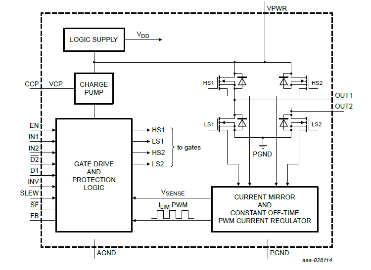](block_diag.PNG)

### Key Features of FRDM-33926PNBEVM LED Driver

- 5.0 V to 28 V continuous operation (transient operation from 5.0 V to 40 V)
- Overcurrent limiting (regulation) via an internal constant-off-time PWM
- Output short-circuit protection (short to VPWR or ground)
- Temperature dependent current limit threshold reduction
- All inputs have an internal source/sink to define the default (floating input) states.

#### Boards: FRDM-MCXA153, FRDM-MCXN947
#### Categories: Motor Control
#### Peripherals: ADC, GPIO, PWM
#### Toolchains: MCUXpresso IDE

## Table of Contents
1. [Software](#step1)
2. [Hardware](#step2)
3. [Setup](#step3)
4. [Results](#step4)
5. [Support](#step6)
6. [Release Notes](#step7)

## 1. Software
- [IoT Sensing SDK (ISSDK) v1.8](https://nxp.com/iot-sensing-sdk) offered as middleware in MCUXpresso SDK for supported platforms
- [MCUXpresso IDE v11.9.0](https://www.nxp.com/design/design-center/software/development-software/mcuxpresso-software-and-tools-/mcuxpresso-integrated-development-environment-ide:MCUXpresso-IDE)

## 2. Hardware
- FRDM-MCXN947 and FRDM-MCXA153 MCU board
- [FRDM-33926PNBEVM](https://www.nxp.com/design/design-center/development-boards-and-designs/analog-toolbox/freedom-kit-mc33926-5-0-a-throttle-h-b:FRDM33926PNBEVM?fpsp=1#documentation) 
- Personal Computer
- Mini/Micro USB Type C USB cable
- Jumper pins/wires
- DC Motor
- Volatge supplier

## 3. Setup
### 3.1 Step 1: Download and Install required Software(s)
- Install MCUXpresso IDE 11.9.0
- Download and Install [MCUXpresso SDK v2.14.0 for FRDM-MCXN947](https://mcuxpresso.nxp.com/en/builder?hw=FRDM-MCXN947). Make sure to select ISSDK  middleware while building SDK.
- Download and Install [MCUXpresso SDK v2.14.2 for FRDM-MCXA153](https://mcuxpresso.nxp.com/en/builder?hw=FRDM-MCXA153). Make sure to select ISSDK  middleware while building SDK.
- Install Git v2.39.0 (for cloning and running west commands).
- Install Putty/Teraterm for UART.
 
### 3.2 Step 2: Clone the APP-CODE-HUB/dm-frdm33926pnbevm-motor-controller-with-demo-app
- Clone this repository to get the example projects:
- Change directory to cloned project folder: 
    cd *dm-frdm33926pnbevm-motor-controller-with-demo-app*
 
**Note:** If you are using Windows to clone the project, then please configure filename length limit using below command
**git config --system core.longpaths true**

### 3.3 Step 3: Build example projects
- Open MCUXpresso IDE and select a directory to create your workspace.
- Install MCXUpresso SDK 2.14.x for FRDM-MCX947, FRDM-MCXA153 (drag and drop SDK zip into "Installed SDK" view) into MCUXpresso IDE.
- Go to "Quickstart Panel" and click on "Import Project(s) from file system",
- Select "Project directory (unpacked)" and browse to the cloned project folder.
- Select example projects that you want to open and run.
- Right click on project and select build to start building the project.

## 4. Test Application Steps
- User needs to connect the input pin(J5) of shield board(33926pnbevm) to voltage supply and output pin (J6) to DC motor as shown below:

  [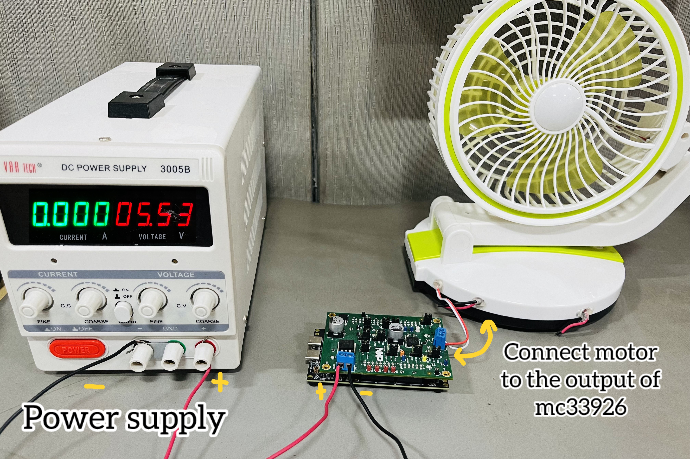](motorcontrol.jpg)

- NOTE: For MCXN947 base board, two different types of rework needs to be done on two different versions of board. Scan the QR or check the mentioned SCH number and revision number on the MCXN947 board to find the correct REV version.

  This rework needs to be done because, in MXN947, by default INT1 & INT2 lines are not connected to PWM1 channel due to which we will be unable to generate PWM signals as an input.
  
  REV A - following shown shorting should be done on SJ3 & SJ4

  [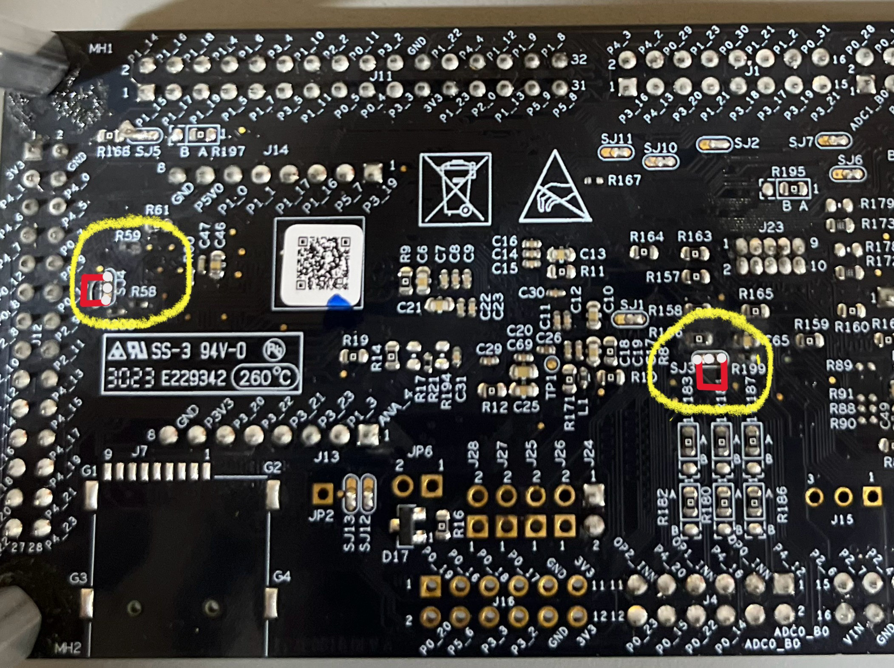](Image1.jpeg)

  REV B - following shown shorting should be done on SJ3 & SJ4
  
  [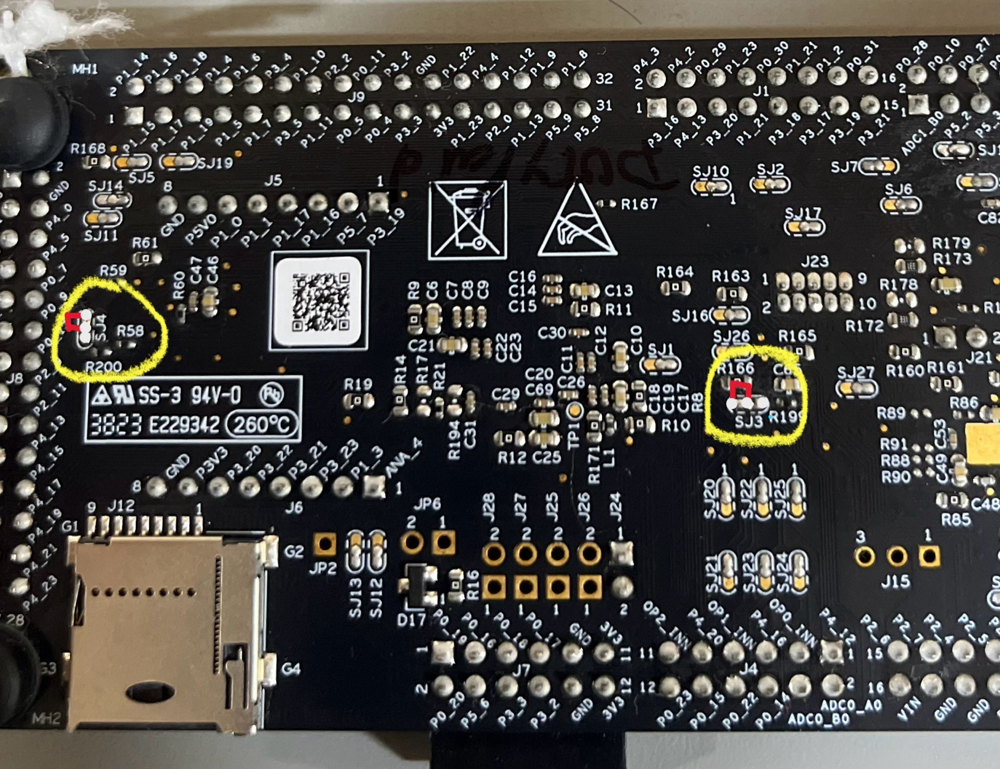](Image2.jpg)

- User needs to check COM port after connecting USB cable between Host PC and Target Board via device manager.

- Open PUTTY/Teraterm application installed on your Windows PC with Baudrate 115200 and assigned COM port as mentioned in above step.

- After right click on project and select "Debug As", Demo application will run in interactive mode. When the demo runs successfully, you can see the logs printed on the terminal.

## 4.1 Logs Results

**Main Menu will look like this**

[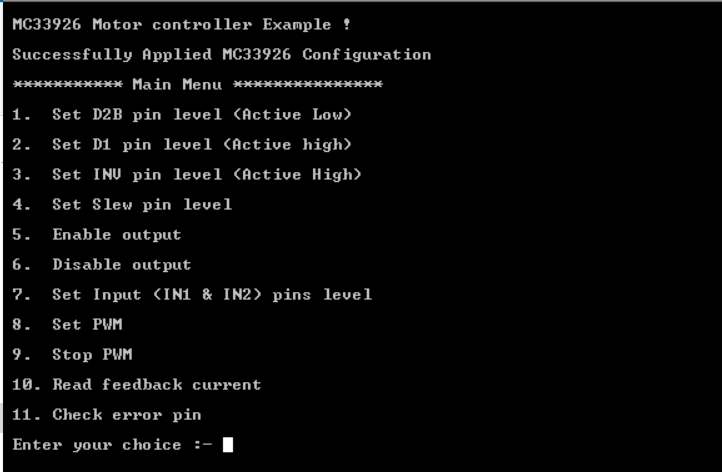](log1.PNG)

**Enter #1 to set disable pin(D2B)** 

- User can either disable the motor device by setting it low or make the motor operational by setting the pin high.   

  [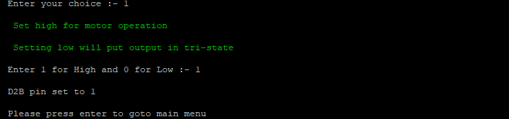](log2.PNG)

**Enter #2 to set another disable pin(D1)** 

- User can either disable the motor device by setting it high or make the motor operational by setting the pin low.   

  [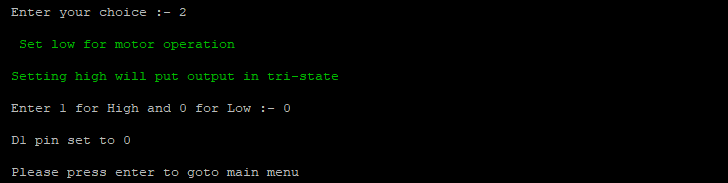](log3.PNG)

**Enter #3 to change the direction of motor** 

- User can reverse/forward the moving motor by entering #3. 

  [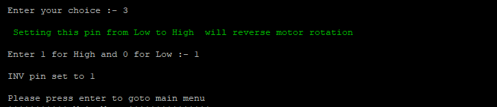](log4.PNG)

**Enter #4 to set the SLEW pin** 

- User can set the slew pin either high or low.(Tho, it has no impact to the output of motor) 

  

**Enter #7 to set the input pins(INT1/INT2)**   

- User can write the INT1/INT2 high or low as per requirements.

- With INT1 high and INT2 low, motor will move in clockwise/forward direction. 
- With INT1 low and INT2 high, motor will move in anti-clockwise/reverse direction. 
  
  

**To enable/disable the motor** 

- To move the motor, firstly set D1, D2B in operational mode. 
- Then, set the INT1/INT2 pins.
- Enable the motor by entering #5

  [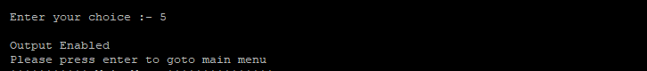](log6.PNG)

- To disable the motor, enter #6

  

**To enable/disable the PWM** 

- User can move the motor by generating PWM at INT1/INT2.
- To move the motor, firstly set D1, D2B in operational mode. 
- Then, set the PWM from scratch by entering #8 ( log shown below).
- Enable the motor by entering #5

  [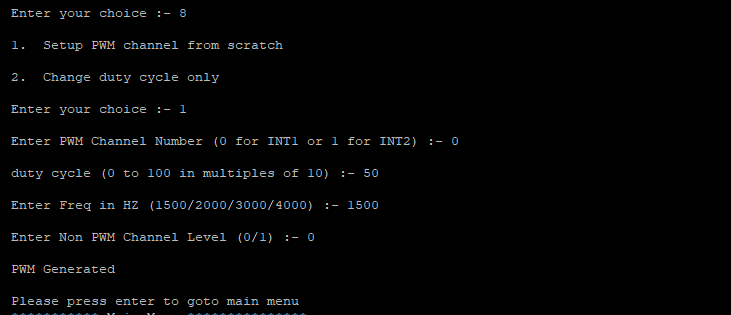](log7.PNG)

- To change the speed of moving motor in between, enter #8 to change the duty cycle. 

  [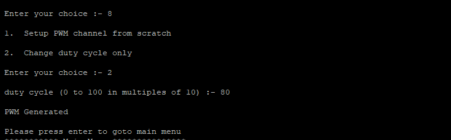](log10.PNG)

- To stop the PWM, enter #9. 

  [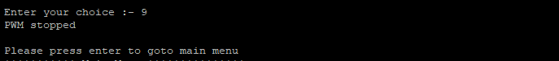](log14.PNG)

**Enter #10 to read the current drawn by the motor(output)** 

- User can read the ADC value of feedback current and ADC count by entering #10

  

**Error detection** 

- User can detect the undervoltage, overvoltage, shortcircuit, Active low D2B pin and Active high D1 pin by entering #11.

- D5 LED on shield board will also glow.  

  

- If error is not there, following prompt will be shown.

   

## 5. Support

#### Project Metadata
<!----- Boards ----->
 

<!----- Categories ----->

<!----- Peripherals ----->

<!----- Toolchains ----->

Questions regarding the content/correctness of this example can be entered as Issues within this GitHub repository.

>**Note**: For more general technical questions regarding NXP Microcontrollers and the difference in expected funcionality, enter your questions on the [NXP Community Forum](https://community.nxp.com/)

## 6. Release Notes
| Version | Description / Update                           | Date                        |
|:-------:|------------------------------------------------|----------------------------:|
| 1.0     | Initial release on Application Code Hub        | Aug 30th 2024 |

